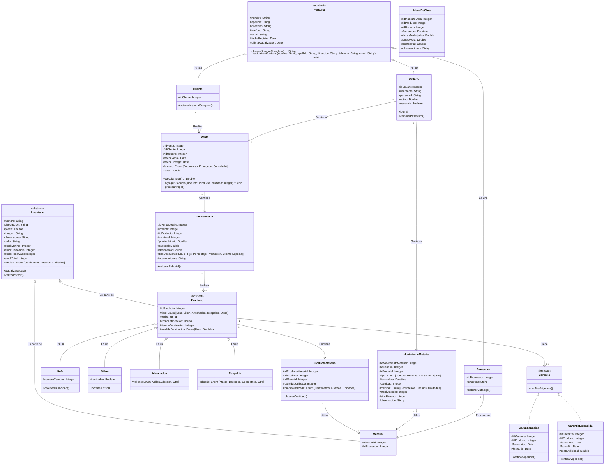
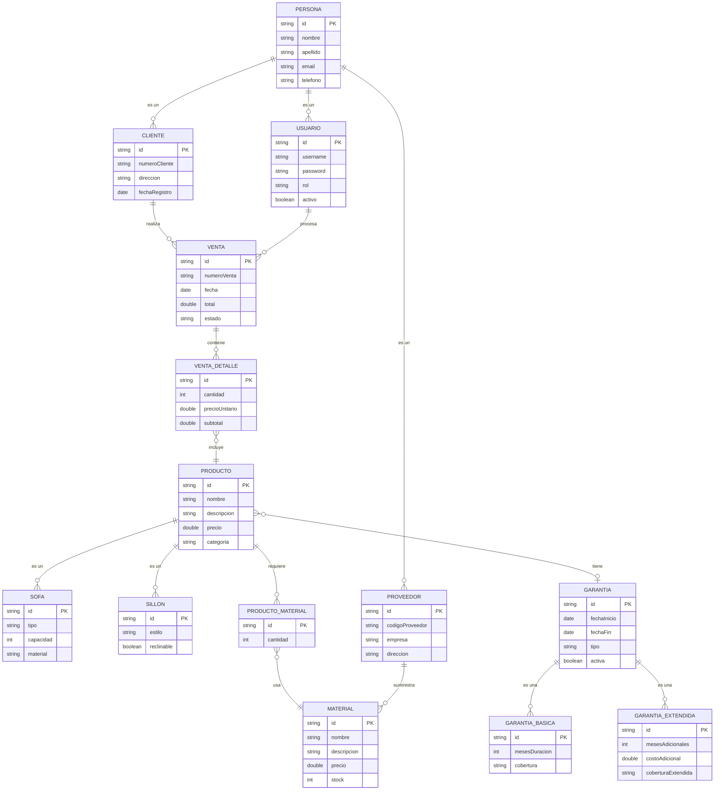
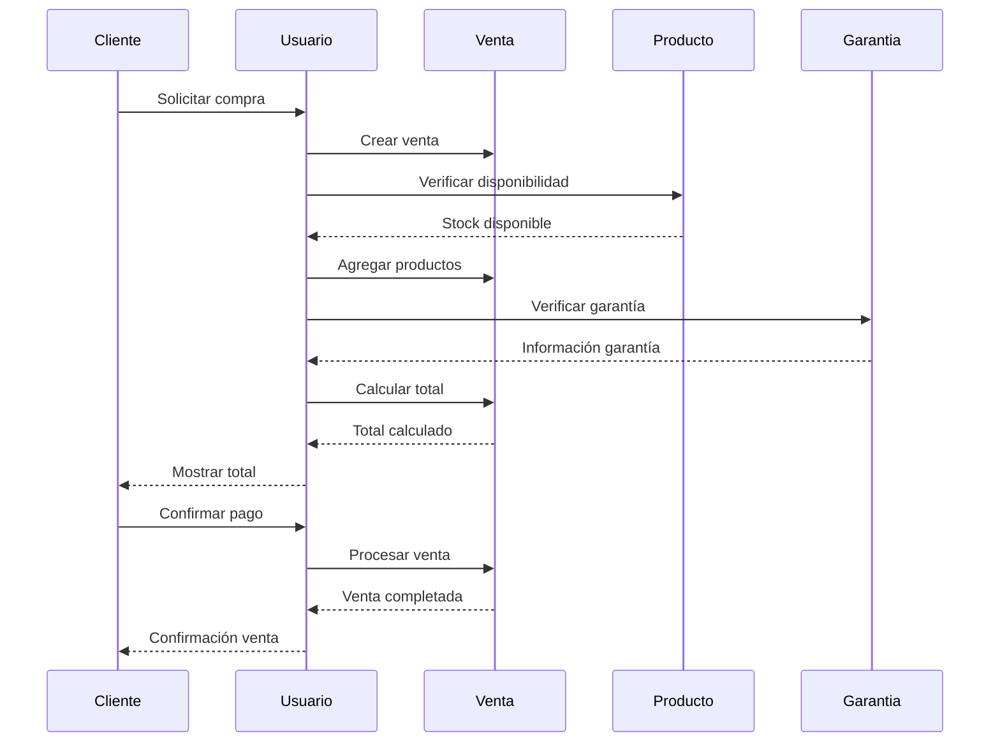

# Diagramas - Sueños en Telas

Los siguientes diagramas muestran las relaciones entre las entidades del sistema "Sueños en telas" y se actualizarán a medida que avance el desarrollo del mismo.

## Diagrama de Clases UML

## Diagrama de Entidad-Relación

## Diagrama de Secuencia - Proceso de Venta

