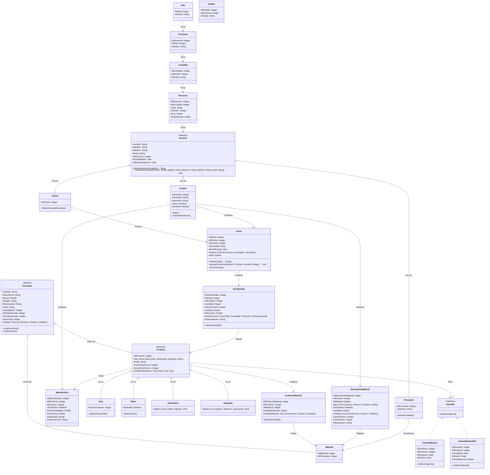
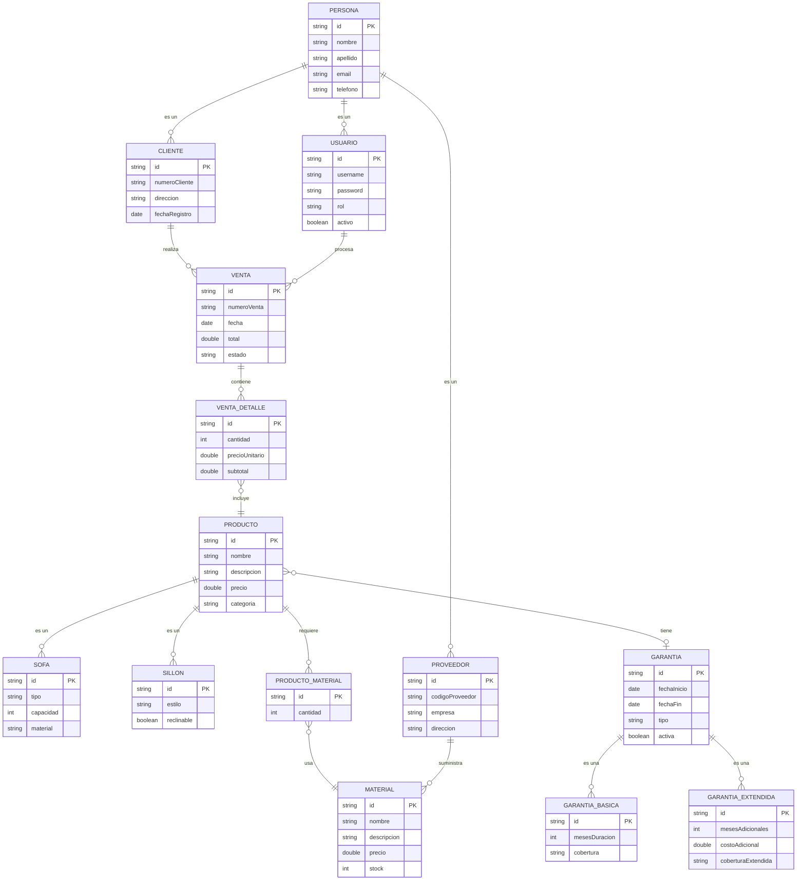
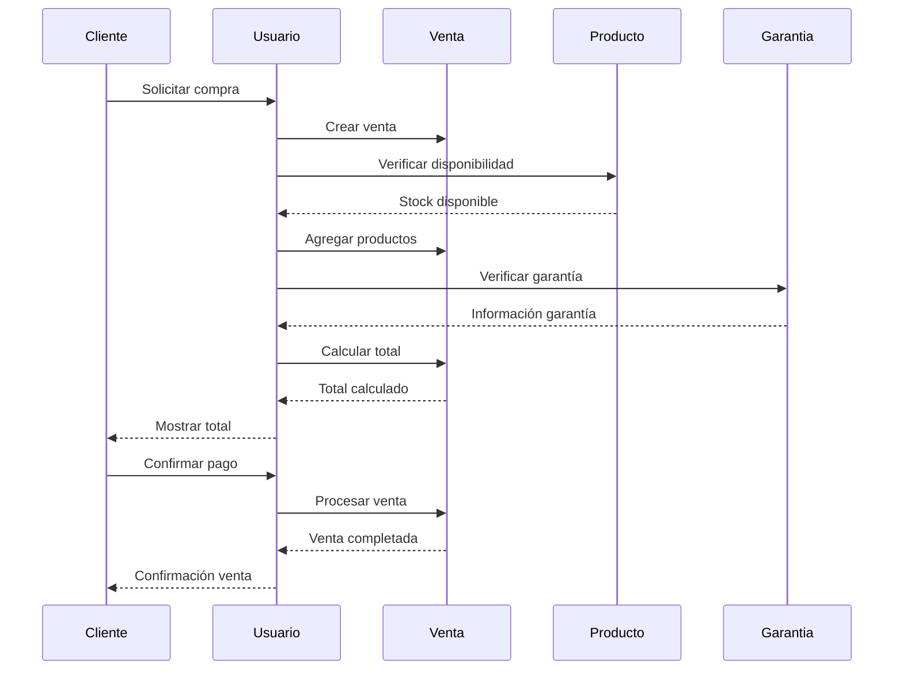

# Sueños en Telas
El siguiente proyecto fue gestionado como parte de la tesis para la carrera Analista en Sistemas y engloba la logica de negocio que utilizará <b>Sueños en Telas</b>, entidad que se dedica a la fabricación, restauración y tapicería de distintos tipos de muebles de interior y dándoles un estilo único e innovador. El servicio buscará cubrir las necesidades basicas de la empresa e incrementará segun las necesidades de la misma, pasando por la carga de ventas, la gestion de las garantias, el control de stock de sus materiales, la posibilidad de gestionar usuarios y clientes, entre otros apartados. 
A continuacion se detallan los pasos de instalacion de la aplicacion (a partir de ahora llamado <b>SET</b>) y las principales caracteristicas que posee:

## Instalacion
SET utiliza <b>>Laravel Framework</b> y está pensado para utilizar una base de datos <b>MySql</b> para su funcionamiento, pero siempre se puede modificar la base de datos desde las variables de entorno.
Es necesario tener instalado en el sistema PHP >= 8.2, Composer y Laravel 12. Luego de tener dichos requerimientos, los pasos a seguir son:

- Clonar este repositorio

``` 
git clone  https://github.com/matiasgomez05/ 
cd
```

- Instalar las dependencias de PHP y Laravel

```
composer install
```

- Copiar y actualizar el archivo `.env` con los datos de conexion a la base de datos

```
cp .env.example .env
```

```
DB_CONNECTION=mysql
DB_HOST=127.0.0.1
DB_PORT=3306
DB_DATABASE=nombre_de_tu_base_de_datos
DB_USERNAME=tu_usuario
DB_PASSWORD=tu_contraseña
```

- Generar la clave única para el funcionamiento de la aplicacion

```
php artisan key:generate
```

- Ejecutar las migraciones. Esto creará las tablas necesarias para que el sistema funcione correctamente

```
php artisan migrate
```

- Poblar la base de datos con los registros iniciales: provincias y localidades argentinas, usuario administrador, entre otros.

```
php artisan db:seed
```

- Ejecutar el servidor e ingresar al link de localhost para utilizar el programa

```
composer run dev
``` 


## Diagramas

Los siguientes diagramas muestran las relaciones entre las entidades del sistema "Sueños en telas" y se actualizarán a medida que avance el desarrollo del mismo.

### Diagrama de Clases UML



## Diagrama de Entidad-Relación



## Diagrama de Secuencia - Proceso de Venta

